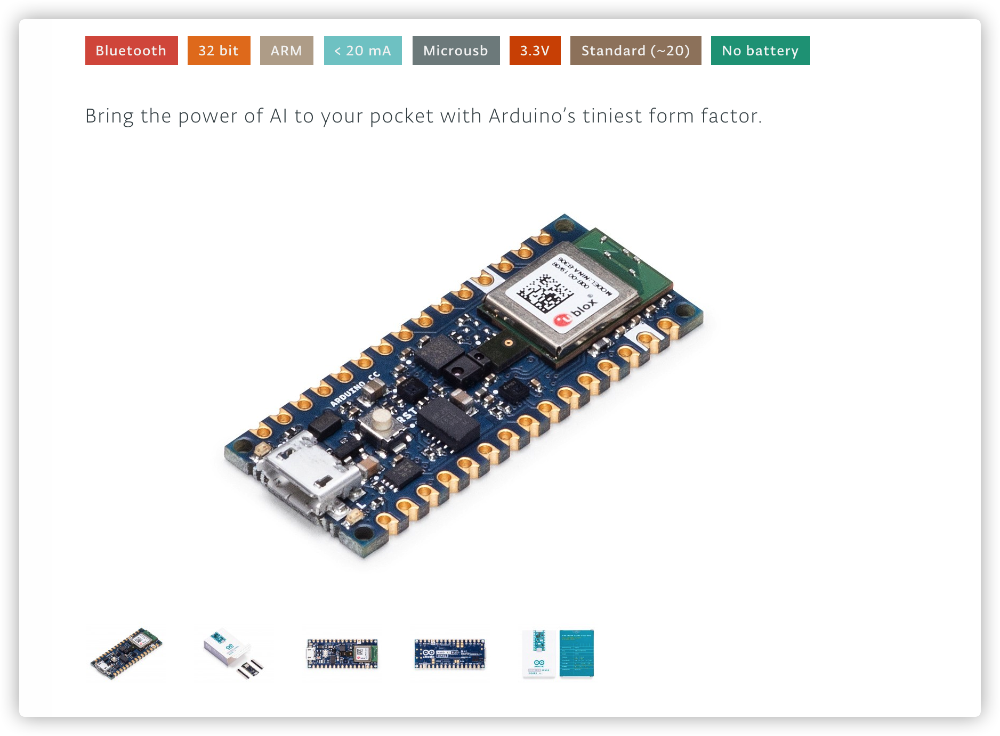
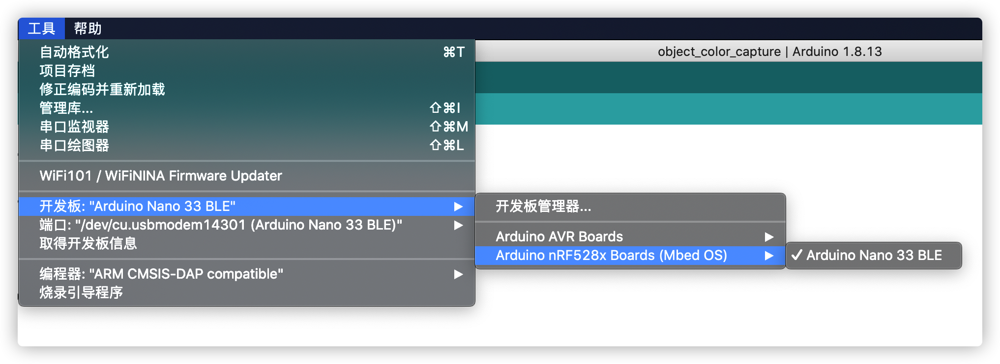
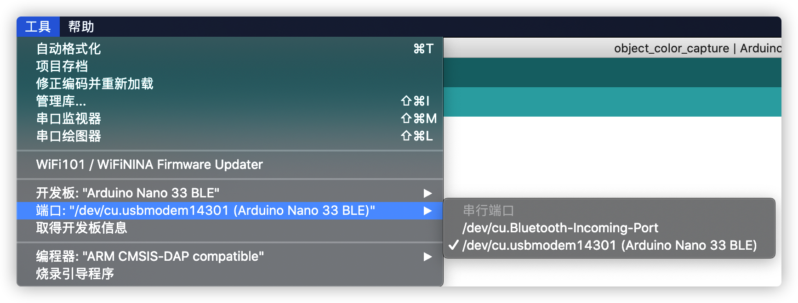
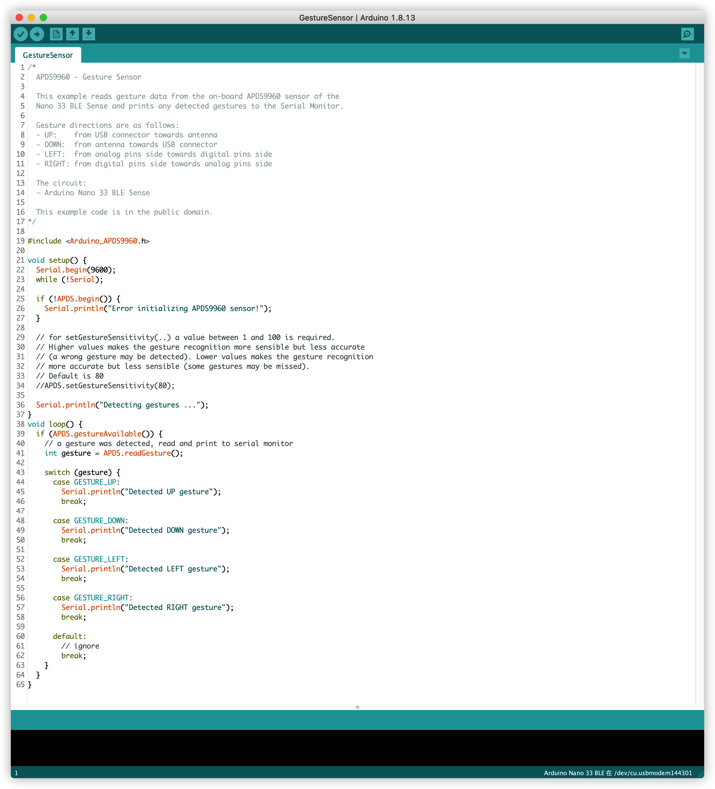
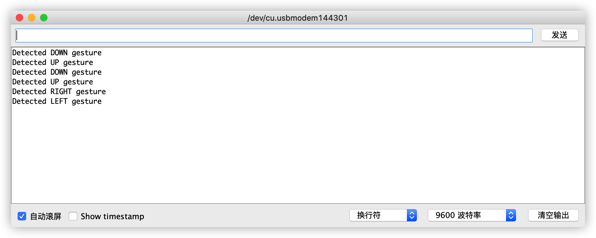

# Arduino Gesture Control

> Arduino Nano BLE 33 sensor 板支持手势传感器，于是我想是否可能通过它来在我的 Mac 上进行控制。

## 环境准备

- Sensor + MicroUSB

  

  > 同一款板子有不同型号，注意区分，它们的差别是板子上传感器数量
  >
  > 选择型号为 ABX00031 或者 ABX00035，它们带有手势传感器

- Arduino IDE

- Python 

## 基本思路

通过 MicroUSB 线连接 sensor 板





为 Arduino 烧录实例项目中的代码



现在在 sensor 传感器一侧挥舞手势，查看串口输出



编写 Python 脚本，这里讲用到两个库 `pynput`, `pyserial` 

```bash
# 安装依赖库
pip install -r requirements.txt
# 执行监听脚本
python listener.py
```

从串口读取手势信息，根据自己的配置调用模拟键盘快捷键执行相应动作。

## 实际效果

